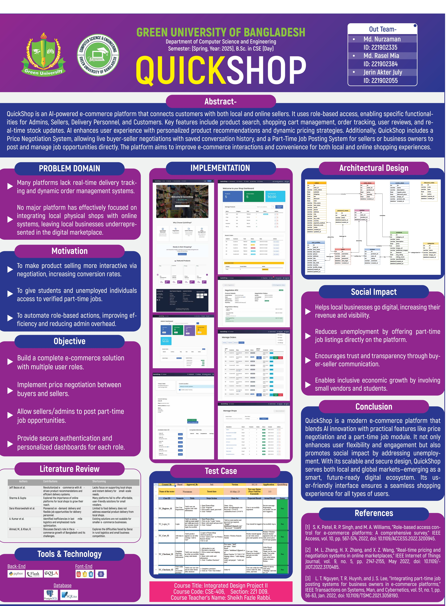
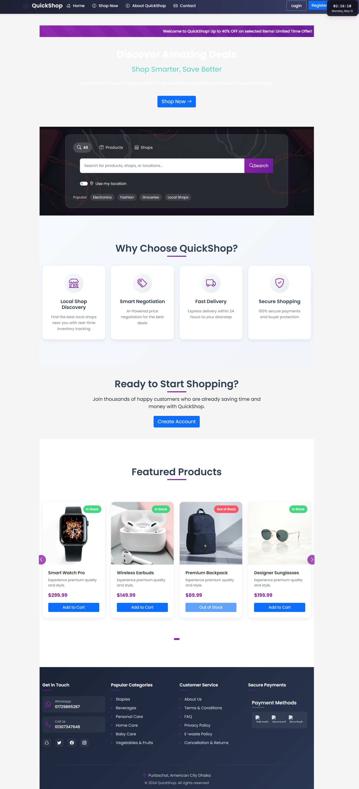

# QuickShop: A Web Application for Local Shop Support”
A comprehensive e-commerce solution featuring role-based access control, smart price negotiations, and real-time delivery tracking.

## Features

- **Multi-Role System**
  - Customer: Browse products, negotiate prices, track orders
  - Shop Owner: Manage inventory, handle orders, customize shop settings
  - Delivery Person: Accept deliveries, update order status
  - Admin: Overall platform management

- **AI-Powered Price Negotiations**
  - Smart negotiation bot for automated price discussions
  - Customizable negotiation parameters for shop owners
  - Real-time chat interface for price discussions

- **Real-Time Delivery Tracking**
  - Live tracking of delivery personnel
  - Automated delivery assignments
  - Status updates and notifications

- **Shop Management**
  - Inventory management
  - Order processing
  - Analytics and reporting
  - Shop settings customization

- **User Features**
  - Local shop discovery
  - Shopping cart management
  - Order history
  - Real-time notifications

## Technology Stack

- **Backend**
  - Python
  - Flask
  # QuickShop: A Web Application for Local Shop Support
  A comprehensive e-commerce solution featuring role-based access control, smart price negotiations, and real-time delivery tracking.

  Repository: https://github.com/Nuruzzaman-Nuru/QuickShop

  Clone with PowerShell:
  ```powershell
  git clone https://github.com/Nuruzzaman-Nuru/QuickShop.git
  cd QuickShop
  ```

  ## Features
  
  - **Multi-Role System**
    - Customer: Browse products, negotiate prices, track orders
    - Shop Owner: Manage inventory, handle orders, customize shop settings
    - Delivery Person: Accept deliveries, update order status
    - Admin: Overall platform management

  - **AI-Powered Price Negotiations**
    - Smart negotiation bot for automated price discussions
    - Customizable negotiation parameters for shop owners
    - Real-time chat interface for price discussions

  - **Real-Time Delivery Tracking**
    - Live tracking of delivery personnel
    - Automated delivery assignments
    - Status updates and notifications

  - **Shop Management**
    - Inventory management
    - Order processing
    - Analytics and reporting
    - Shop settings customization

  - **User Features**
    - Local shop discovery
    - Shopping cart management
    - Order history
    - Real-time notifications

  ## Technology Stack

  - **Backend**
    - Python
    - Flask
    - SQLAlchemy
    - Flask-Login for authentication
    - Flask-Mail for notifications

  - **Frontend**
    - HTML/CSS
    - Tailwind CSS
    - JavaScript
    - Google Maps API for location services

  - **Database**
    - SQLite (Development)
    - Supports PostgreSQL (Production)
 
  
  ## Installation

  1. Clone the repository
  2. Create a virtual environment:
     ```powershell
     python -m venv venv
     venv\Scripts\Activate.ps1
     ```
  3. Install dependencies:
     ```powershell
     pip install -r requirements.txt
     ```
  4. Set up environment variables (example):
     ```powershell
     $env:SECRET_KEY = "your-secret-key"
     $env:DATABASE_URL = "sqlite:///instance/ecommerce.db"
     # $env:GOOGLE_MAPS_API_KEY = "your-google-maps-api-key"
     ```
  5. Initialize the database/migrations (the repo contains a simple migrate script):
     ```powershell
     python migrate.py
     ```

  ## Running the Application

  Development mode:
  ```powershell
  python run.py
  ```
  The application will be available at `http://localhost:4000`

  ## Project Structure

  ```
  ecommerce/
  ├── __init__.py          # App initialization
  ├── config.py            # Configuration settings
  ├── models/              # Database models
  ├── routes/              # Route handlers
  ├── static/              # Static files (CSS, JS, images)
  ├── templates/           # HTML templates
  └── utils/               # Utility functions
      ├── ai/              # AI negotiation systems
      ├── distance.py      # Distance calculations
      └── notifications.py # Notification system
  ```

  ## Testing

  Run tests using:
  ```powershell
  python -m pytest tests/
  ```

  ## AI Assistant (Local negotiation bot)

  A small demo assistant was added to demonstrate the local negotiation bot found in `ecommerce/utils/ai/negotiation_bot.py`.

  - Demo page: `/ai/` (uses `ecommerce/templates/ai/assistant.html`)
  - API endpoint: `POST /ai/negotiate` with JSON { product_id: int, offered_price: float }

  This feature uses the repository's local negotiation logic and does not call external AI services.

  ## Contributing

  1. Fork the repository
  2. Create a feature branch
  3. Commit your changes
  4. Push to the branch
  5. Create a Pull Request


  This project is licensed under the MIT License.
## License

This project is licensed under the [MIT License](LICENSE).

You are free to use, copy, modify, merge, publish, distribute, sublicense, and/or sell copies of this project,  
as long as you include the above copyright notice and this permission notice in all copies or substantial portions of the software.

**Disclaimer:** This software is provided "as is", without warranty of any kind. The author shall not be held liable for any damages arising from the use of this software.
